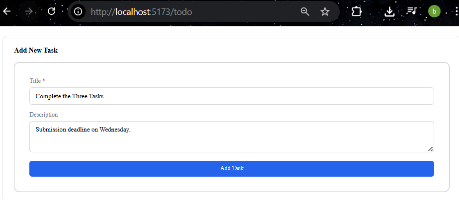
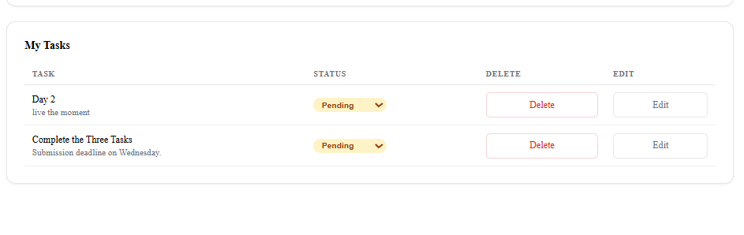
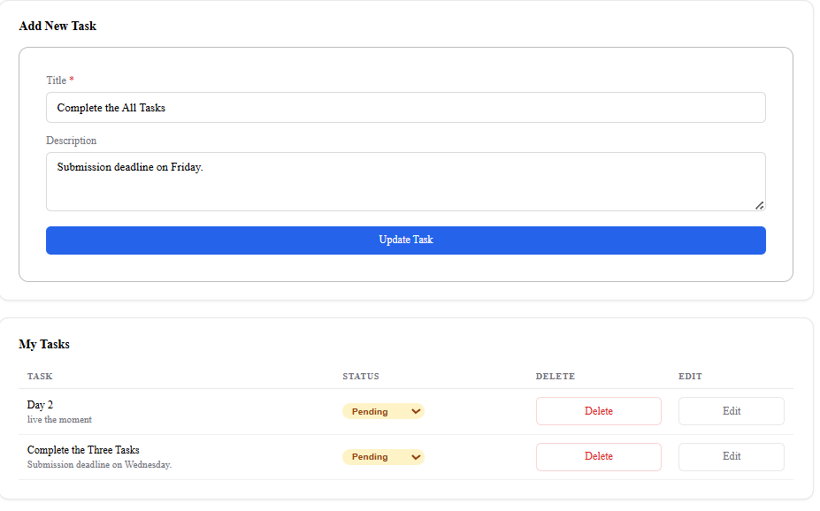
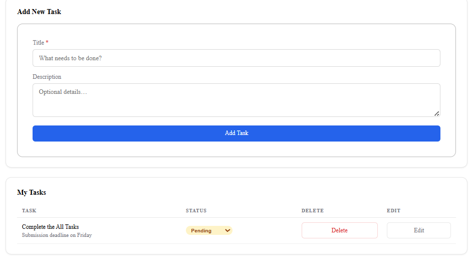
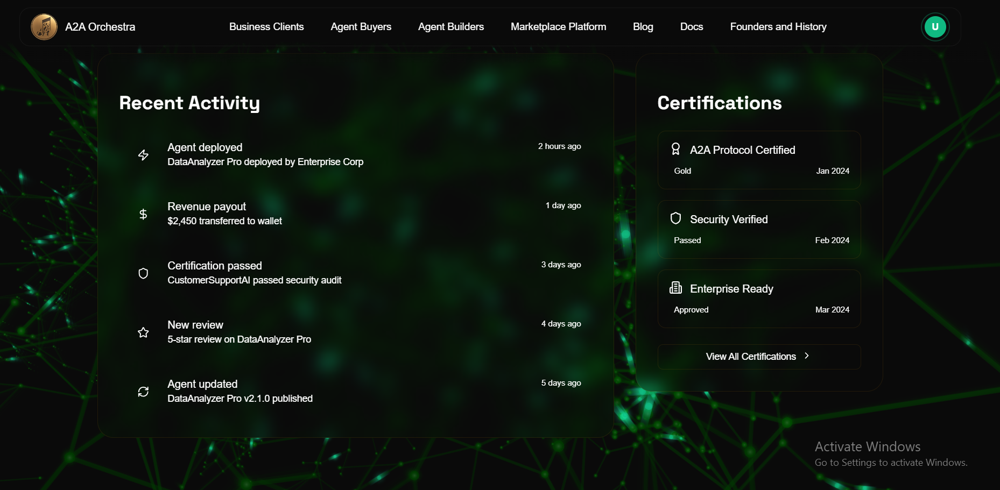

# Software Developer Applicant Tasks

This repository contains the completed tasks for the **Software Developer Applicant** assignment from **Mentor Friends Pvt. Ltd.**  

Tasks included:  
1. **To-Do List Application** using FreeSchema  
2. **WICO System Website Creation**  
3. **Business Client Registration on A2A Orchestra**  

---

## Task 1: To-Do List Application

### Overview
A **To-Do List Application** built with the **FreeSchema Data Fabric** framework.  
It demonstrates **CRUD operations**: Create, List, Edit, and Delete tasks.

### Features
- **Create Task:** Add new tasks with a title and description.  
- **List Tasks:** Display all tasks in a structured list.  
- **Edit Task:** Modify existing tasks.  
- **Delete Task:** Remove tasks as needed.  

### Technology Stack
- **Frontend:** FreeSchema Data Fabric  
- **Libraries / Tools:** (add if used, e.g., FreeSchema components, css)  
- **Backend / Storage:** FreeSchema inbuilt storage  
**First step is to register and login then complete all the crud operation**
### Screenshots
**Add Task**  
  

**Task List**  
  

**Edit Task**  
  

**Delete Task**  
  

## Task 2: Wico
https://develop.freeschema.com/page-preview/104012800
**Single Page**  

## Task 3: Business Client Registration

- Successfully registered as a Business Client on A2A Orchestra
- Explored dashboard and system features
- Reviewed BoomConsole platform and provided feedback

### Feedback Summary:
- UI is clean and user-friendly 
- Navigation is intuitive
- it is kind of laggy while scrolling
- Some improvements can be made in performance and CTA clarity (bit confusing)
**Slow while scrolling**  

